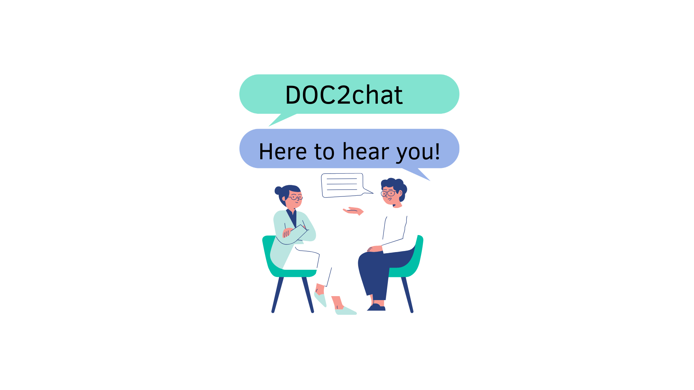

This intelligent chatbot is designed to support patients in understanding their medical procedures through clear, accessible explanations based on the official informed consent form. It  ensures that patients are truly informed before giving their consent. By providing answers in real-time and using easy-to-understand language, the chatbot enhances patient confidence, supports compliance, and improves the overall consent process for healthcare providers.
## Table of Contents

1. [Overview](#overview)
2. [Features](#features)
3. [Installation](#installation)
4. [Usage](#usage)
5. [Configuration](#configuration)
6. [Contributing](#contributing)
7. [FAQ](#faq)
8. [License](#license)
9. [Acknowledgments](#acknowledgments)
10. [Tips and Tricks](#tips-and-tricks)

---

## Overview

This project is a **LLM**(Large Language Model) based  chatbot  designed to guide patients through the informed consent process before a medical procedure. It ensures that patients receive accurate, comprehensible, and consistent information derived directly from the official informed consent documents — minimizing the risk of hallucinated or incorrect answers.

##  Key Features


**RAG-based** architecture: Combines retrieval from approved informed consent documents with generative responses to ensure factual accuracy and relevance.

**Multi-level language prompts**: Offers three different levels of explanation (basic, intermediate, and detailed) to adapt to each patient’s health literacy.

**Web-based interface**: A user-friendly web application where patients can interact with the chatbot in a conversational format.

**Session history and traceability**: All interactions are stored securely, enabling:
Doctors to review the full question-answer history for compliance and clarification.
Patients to receive a summarized transcript of their session for reference and review.


This tool enhances patient understanding, supports shared decision-making, and streamlines documentation for healthcare providers.

---


## Installation & Usage 

**Prerequisites**:
- Python 3.9+, pip, GPU (for faster inference).

**Steps**:
```bash
# Clone the repository
git clone https://github.com/username/repository-name.git

# Navigate to the directory
cd repository-name

# Create virtual environment with venv 
pip install venv

python -m venv .venv

# Activate Virtual Environment
pip source ./.env/bin/activate

# Run code (with activated virtual environment)

```bash
# Basic usage with default options
python ./run_chatbot.py

# Specify model (choose between "mistral" or "dummy")
python ./run_chatbot.py --model mistral
python ./run_chatbot.py --model dummy

# Disable checking for missing packages
python ./run_chatbot.py --check_missing False

# Combine options
python ./run_chatbot.py --model dummy --check_missing False
```

**Options:**
- `--model`: Selects the model to use (`mistral` or `dummy`). Default: `mistral`.
     The dummy model allows you to check the UI without having to download the mistral model.
- `--check_missing`: Enable or disable checking for missing packages. Accepts `True` or `False`. Default: `True`.


### Trivia

1.) **Initial Setup Time:** Installing all required libraries and downloading the local Mistral 7B model typically takes about 5–10 minutes.

2.) **GPU Detection:** Ollama automatically detects available GPUs. Without a GPU, response times may exceed 2 minutes. With a GPU (e.g., Quadro RTX 6000), responses are typically returned in 2–6 seconds.

3.) The chat history is automatically saved in the [output folder](./meta_data/output/). With the use of the [PDF Creater](./Output_Creator/Create_pdf.ipynb) the output .yaml will be transformed into a better readable .pdf file 

4.)


## Example Output
Provide a brief description or screenshots of expected outputs (if applicable).


## Future Implementation 
* History based Retriever 
* 
## Citation

## Acknowledgments # FIXME !!!!
Mention contributors, libraries, and resources used in the project.

## License
This project is licensed under the GNU General Public License v3.0 - see the [LICENSE.md](LICENSE.md) file for details.


## TODO
explain how to load other vector db ( deleting vector database)

BUG gradio not installed 