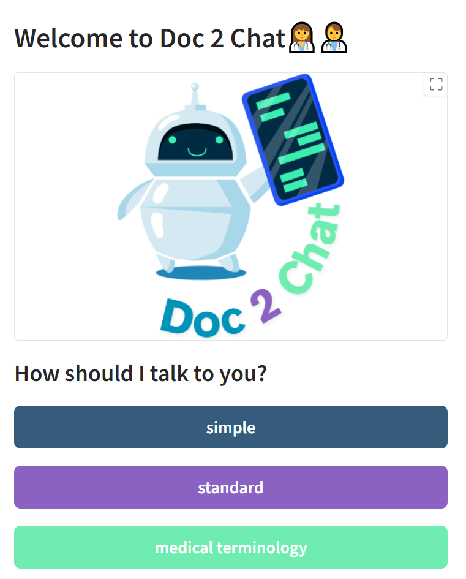
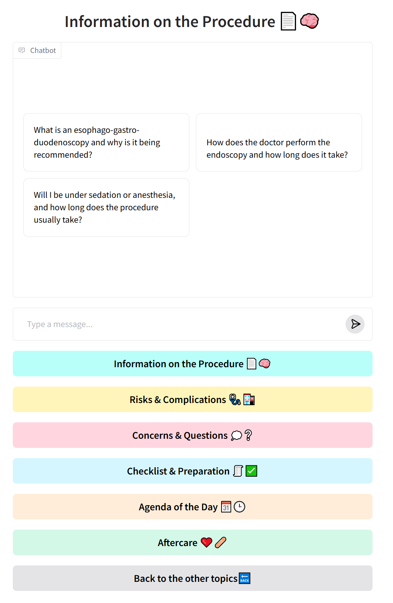

This intelligent chatbot is designed to support patients in understanding their medical procedures through clear, accessible explanations based on the official informed consent form. It ensures that patients are truly informed before giving their consent. By providing answers in real-time and using easy-to-understand language, the chatbot enhances patient confidence, supports compliance, and improves the overall consent process for healthcare providers.

## Table of Contents

1. [Overview](#overview)
2. [Features](#features)
3. [Installation](#installation)
4. [Usage](#usage)
4. [Trivia](#trivia)
5. [Example Output](#example-output)
6. [Future Implementation](#future-implementation)
7. [Citation](#citation)
8. [Acknowledgments](#acknowledgments)
9. [License](#license)
10. [TODO](#todo)

---

## Overview

This project features a **Large Language Model (LLM)**-powered chatbot that assists patients in navigating the informed consent process prior to medical procedures. By leveraging official informed consent documents, the chatbot delivers accurate, clear, and consistent information, reducing the risk of misunderstandings or hallucinated responses. Designed to run on a secure, local model, it ensures patient data remains private and is never shared with third parties.

## Features

**RAG-based** architecture: Combines retrieval from approved informed consent documents with generative responses to ensure factual accuracy and relevance.

**Multi-level language prompts**: Offers three different levels of explanation (basic, intermediate, and detailed) to adapt to each patient’s health literacy.

**Web-based interface**: A user-friendly web application where patients can interact with the chatbot in a conversational format.

**Session history and traceability**: All interactions are stored securely, enabling:
Doctors to review the full question-answer history for compliance and clarification.
Patients to receive a summarized transcript of their session for reference and review.

This tool enhances patient understanding, supports shared decision-making, and streamlines documentation for healthcare providers.

## Installation & Usage 

**Prerequisites**:

- At least 8GB RAM and 10GB free disk space
- Stable internet connection — downloading the language model can take a while!
- Python 3.9+, pip, GPU (for faster inference).   (You don't need to have Python or pip for Docker)

We provide two ways of installing doc 2 chat. 
1.) Docker (recommended)
2.) Python 

### 1.) Docker
Prerequisites:

- Docker installed on your system

**Installation Steps**:

Install Docker (if not already installed):

- Windows/Mac: Download Docker Desktop from https://www.docker.com/products/docker-desktop/
- Linux: Follow the official guide at https://docs.docker.com/engine/install/


**Clone the repository**:
```bash
git clone https://github.com/username/repository-name.git
cd repository-name
```
**Docker Usage Options**:
```bash
# Run the application
docker compose up  

# (That's it! Wait for everything to download and you are ready to use the App!)

# Stop the application
docker compose down
```
**Docker Management**:
```bash
# List all running containers
docker ps

# List all containers (even stopped ones)
docker ps -a

# List all Docker images
docker images

# Remove stopped containers
docker container prune

# Remove unused images
docker image prune

# OR remove a specific container/image by name or ID
docker rm <container_id_or_name>
docker rmi <image_id_or_name>
```
**Pruning and removing images/containers will permanently delete them from your system.**
### 2.) Python

**Steps**:
```bash
# Clone the repository
git clone https://github.com/username/repository-name.git

# Navigate to the directory
cd doc-chat

# Create virtual environment with venv 
pip install venv

python -m venv .venv

# Activate Virtual Environment
source ./.env/bin/activate

# Install Requirements ( only needs to be done once at the beginning)
pip install -r requirements.txt

# Run code (with activated virtual environment)

```bash
# Basic usage with default options
python ./run_chatbot.py

# Specify model (choose between "mistral" or "dummy")
python ./run_chatbot.py --model mistral
python ./run_chatbot.py --model dummy

# Disable checking for missing packages
python ./run_chatbot.py --check_missing False

# Combine options
python ./run_chatbot.py --model dummy --check_missing False
```

**Options:**
- `--model`: Selects the model to use (`mistral` or `dummy`). Default: `mistral`.
    The dummy model allows you to check the UI without having to download the mistral model.
- `--check_missing`: Enable or disable checking for missing packages. Accepts `True` or `False`. Default: `True`.

## Usage
### Page 1
<table>
<tr>
<td width="30%">
    
</td>
<td>

**Starting Page:**  
Choosing the right level helps ensure that the patient receives information in a way that is most helpful and least confusing for them

**Simple:** The chatbot uses very basic, everyday language. It avoids medical jargon and explains things in a way that anyone, regardless of background, can understand.

***Standard***: The chatbot uses general language that might include some common medical terms, but still aims to be accessible to most people. It balances clarity with a bit more detail, suitable for users who are comfortable with basic health vocabulary.

***Medical Terminology***:
The chatbot uses precise, technical medical language. This level is intended for healthcare professionals or patients who are familiar with medical terms and want detailed, accurate information. It may include specific diagnoses, procedures, or pharmacological terms.
</td>
</tr>
</table>

### Page 2

<table>
<tr>
<td>

**Main Page:**  
On the main page, you will find a variety of categories covering different aspects of your medical procedure. Each category includes example questions designed to guide your exploration and deepen your understanding. You can select any of these questions to see clear, concise answers, or you may enter your own questions into the chat interface for personalized information.

The chatbot is designed to adapt to your needs—if you wish to change the level of detail or complexity in the explanations, simply click "Back to Language Settings" at any time. This allows you to choose between simple, standard, or medical terminology explanations, ensuring that the information is presented in a way that matches your comfort level and preferences. This flexible approach empowers you to make informed decisions and feel confident throughout the consent process.

Between topics, the previous chat history changes—this is a feature, not a bug. It allows answered questions to remain within the category. However, the model will see all inputs in the exact order, independent of the categories.

The history is also automatically stored in a file and can always be accessed, so that the doctor can always check what was proposed by the LLM.

</td>
<td width="50%">
    
</td>
</tr>
</table>

 

## FAQ

1.) **How long does the setup take?** Installing all required libraries and downloading the local Mistral 7B model typically takes about 5–10 minutes.

2.) **How fast does the model answer?** Ollama automatically detects available GPUs. Without a GPU, response times may exceed 2 minutes. With a GPU (e.g., Quadro RTX 6000), responses are typically returned in 2–6 seconds.

3.) **Where can i find the chat history?** The chat history is automatically saved in the [output folder](./meta_data/output/). With the use of the [PDF Creater](./Output_Creator/Create_pdf.ipynb) the output .yaml will be transformed into a better readable .pdf file 


## Future Implementation 
* History based Retriever for more effciency.
* Testing bigger models 
* Testing for robustness
* Returning clean .pdf files that are flagged if the model hallucinated instead of providing information form the provided  informed consent form

## Citation

## Acknowledgments

We gratefully acknowledge the following open-source tools and libraries that made this project possible:

- [**Ollama**](https://ollama.com/) – For efficient local LLM inference and model management.
- [**FAISS**](https://github.com/facebookresearch/faiss) – For fast vector similarity search and retrieval.
- [**Gradio**](https://gradio.app/) – For building the interactive web-based user interface.


## License
This project is licensed under the GNU General Public License v3.0 - see the [LICENSE.md](LICENSE.md) file for details.


